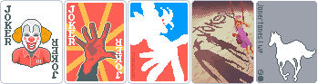
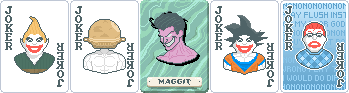
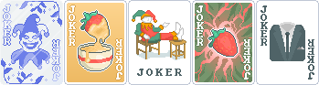
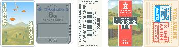
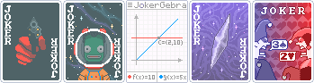
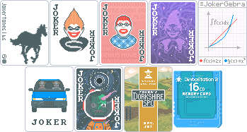
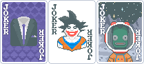

<!--
Flowire Note: I can't speak Portuguese and using a Translator isn't a good choice. :>
Supported languages:  
-->

  

___
# Buffoonery
A Balatro mod that aims to add vanilla-adjacent content while maintaining its own style:

- 34 Jokers
  > 9 Common  10 Uncommon  5 Rare  9 Special*  1 Legendary
- 4 Decks
  > With 4 respective [Card Sleeves](https://github.com/larswijn/CardSleeves)
- 2 Enhancements
  > Applied by 1 Tarot Card
- 2 Stakes
  > After Gold Stake

 **<ins>Recommended</ins>: Download the [latest Release](https://github.com/pinkmaggit-hub/Buffoonery/releases)!**

# Content
For more Information, keep on scrolling or check out the [Buffoonery Wiki](https://balatromods.miraheze.org/wiki/Buffoonery)!

## Jokers

| Name | Effect |
| ---- | ---- |
| Clown | Gains +15 Chips when another Joker is added |
| Five Fingers | X2.5 Mult if you own a multiple of 5 Jokers and score exactly 5 cards |
| Rerollin' | Earn $20 for your fifth Reroll once per Shop |
| Korny | Gives varying amount of Chips Unknown chance to be Destroyed |
| White Pony | +3 Mult Doubles each Ante |

| Name | Effect |
| ---- | ---- |
| Adoring Fan | Doesn't Cost anything +15 Mult, Costs $6 to sell 50% to return when sold |
| Let Me Solo Her | +20 Mult Debuffed when not alone Defeating a Boss Blind rewards 5 Jokers (atleast 2 Rares!) |
| Maggit | ^1.5 Mult when you own a Numetal Joker (Will grant One once) |
| Sayajimbo | Gets better Effects with higher Scores... |
| Patronizing Joker | X5 Chips Always forces 5 cards to be selected. |

| Name | Effect |
| ---- | ---- |
| Porcelain Joker | Gains X0.75 Chips for  every 3 Porcelain Cards |
| Gold Fondue | Grants $8 for first hand played each round Loses $2 at end of round |
| Laidback Joker | X2 Mult Takes up 2 Slots |
| Camarosa | ^1.25 Mult 1 in 1000 chance to be Destroyed |
| Tailored Suit | Gives X-Mult based on the predominant suit in your full Deck |

| Name | Effect |
| ---- | ---- |
| Clay Shooting | Gives $8 when Blind is defeated in a certain amount of hands |
| Memory Card | Saves the first scored card each round, sell to transform cards held in hands into saved ones. Can save up to 8 cards. |
| Cashout Voucher | If winning Hand scores triple the required score, gain 0.4% of the score as Money (Maximum of $50) |
| Dorkshire Tea | All 2s, 3s and 10s become Porcelain Cards before scoring, if poker hand is a Three of a Kind |
| Arstotzkan Denial | +5 Mult for each Red Seal in your Deck +30 Chips for each Blue Seal in your Deck |

| Name | Effect |
| ---- | ---- |
| Russian Roulette | Earn $15 and 1 in 6 chance to lose the game at start of the round. Chance increases each round, surviving grants a Legendary Joker |
| Jebediah Kerman | Gains +8 Mult when using a Planet Card 1 in 6 chance to EXPLODE when using a Planet Card |
| JokerGebra | Play +1 Card per Hand X2 Chips when the amount of played cards is equal to the solution for 'X' Has a different puzzle each Hand |
| Abyssal Prism | When acquired, Exile all other Jokers and spawn an Echo. One becomes Negative every 3 turns. Sell to return all Exiled Jokers. |
| Pertinent Argument | Converts an unscored card into one of the scored ones, if poker hand is a Two Pair |

### Special Jokers
*They don't spawn, but are granted to the player under special circumstances.*

Click to show: Special/Hidden Jokers

  

| Name | Effect | Source |
| ---- | ---- | ---- |
| Black Stallion | +1 Mult Doubles each Ante | **Galloping Deck** |
| Bitter Ex-Fan | Flips and Shuffles all Jokers or Cards held in hand. Costs $25 to sell. Sell price turns positive after 5 rounds. | **Adoring Fan** Joker |
| Supportive Joker | X4 Chips Tells you the 3 topmost cards of your Deck in order | **Patronizing Joker** Joker |
| Echo of The Abyss | +6 Mult for each stored Joker | **Abyssal Prism** Joker |
| Integral | Play +2 Cards per Hand ^1.2 Chips when the amount of played cards is equal to the solution for 'X' Has a different puzzle each Hand E-Multiplier increases with correct answers | **JokerGebra** Joker |
| Van | Gains +30 Chips when another Joker is added Chips gained is affected by Clowns | **Clown** Joker |
| Jebediah Reborn | Gains +8 Mult when using a Planet Card +25% Mult when using a Black Hole | **Jebediah Kerman** Joker |
| Dorkshire Gold | All 2s, 3s and 10s become Royal Porcelain Cards before scoring, if poker hand is a Three of a Kind | **Porcelain Sleeve** |
| Deluxe Memory Card | Saves the first scored card each round, sell to transform cards held in hands into saved ones. Can save up to 16 cards. | **JimboStation Sleeve** |

### Joker Textures

**Keep an eye out**, some Jokers have changing Textures!

## Decks

| Name | Effect |
| ---- | ---- |
| JimboStation Deck | +1 Hand size Start run with **Memory Card** Joker |
| Galloping Deck | Start run with **Black Stallion** Joker |
| Porcelain Deck | Start run with 1 less full Suit and **Dorkshire Tea** Joker |
| Sandstone Deck | 25% lowered Win Ante X2 base Blind size |

### Sleeves

[Card Sleeves](https://github.com/larswijn/CardSleeves) apply their respective Decks effect.
Combined with their Deck, they apply a different Effect:

| Name | Deck + Sleeve |
| ---- | ---- |
| JimboStation Sleeve | Start run with **Deluxe Memory Card** Joker instead |
| Galloping Sleeve | Start run with **White Pony** Joker instead |
| Porcelain Sleeve | Start run with **Dorkshire Gold** Joker instead |
| Sandstone Sleeve | 37.5% lowered Win Ante X3 base Blind size |

## Enhancements

| Name | Effect |
| ---- | ---- |
| Tarot: Nobility | Enhances 1 selected card into a Porcelain Card or Royal Porcelain Card if you own at least $50 |
| Porcelain Card | Fragile* X1.75 Chips |
| Royal Porcelain Card | Fragile* X2.0 Chips and considered as Face-Card |

***Fragile**:
Porcelain Cards are destroyed when
played hand contains more than 3 cards.

## Stakes

| Name | Effect | Order |
| ---- | ---- | ---- |
| Palladium Stake | Showdown Boss Blinds appear twice as often | After Gold Stake or after [Platinum Stake](https://github.com/blazingulag/Prism) |
| Spinel Stake | 50% increased Win Ante | After Palladium Stake |
